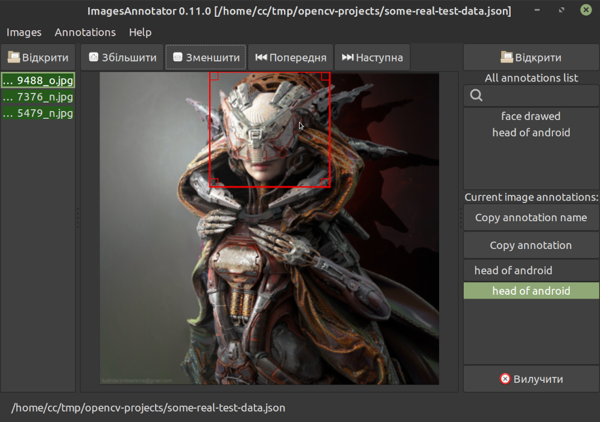

**Програма для розмітки і коменутвання зображень ImageAnnotator**

# Ціль проекту коментатора зображень

Ціль проекту коментатора зображень являється розмітка і надання інформації про зміст обраних зображень для її постачання для тренування нейромереж або ШІ з наступним завантаженням натренованої мережі у бібліотеки комп'ютерного бачення на подобі [OpenCV](https://github.com/opencv/opencv).

Окрім своєї основної цілі проект виконує також дослідницькі задачі. Отож може виглядати більш ускладненим ніж зазвичай.

Реалізація проекту значно пришвидшена завдяки C++ проекту-шаблону розміщеного за адресою [https://github.com/yuriysydor1991/cpp-app-template](https://github.com/yuriysydor1991/cpp-app-template)

**УВАГА! Поточний проект анотатора зображень знаходиться у альфа стані! Тому необхідно часто зберігати дані і робити резервні копії даних!**

Більше за посиланням [kytok.org.ua](http://www.kytok.org.ua/)

💵 Підтримай проект за посиланням [http://kytok.org.ua/page/pozertvy](http://kytok.org.ua/page/pozertvy)

# Usage

Основне вікно програми після її запуску може виглядати наступним чином.

Зверху вікна розміщене меню:

- `Images` для імпортування і додавання директорії з зображеннями до поточного проекту,
- `Annotations` для управління поточним проектом,
- `Help` для допомоги.

Наступними у рядок розміщені кнопки для відкривання і додавання нової директорії з зображеннями до поточного проекту (дубльований з меню `Images`), кнопки для збільшення або зменшення поточного обраного зображення на центральній робочій області, далі розміщені кнопки наступного чи попереднього зображення з списку відкрити зображень на лівій панелі списку, і на кінець продубльована кнопка для відкриття існуючого проекту бази анотацій (на даний момент підтримується тільки внутрішній JSON формат).

Зображення що позначені зеленим кольором на лівій панелі вказують що у кожному з них присутня хоча-б одна анотація.

На правій панелі присутній список усіх анотацій чи розмітки зображень у поточному проекті. Під ним розміщений список анотацій для поточного обраного зображення з центральної робочої області. Кнопка `Copy annotation name` призначена для копіювання тексту з обраної анотації зі списку усіх анотацій у обрану анотацію поточного зображення. Кнопка `copy annotation` дублює обрану анотацію поточного зображення. Кнопка видалення знизу списку анотацій поточного зображення видаляє обрану анотацію поточного обраного зображення відповідно.

Внизу вікна розміщена панель статусу котра на даний момент висвітлює тільки поточний шлях до відкритого JSON-файлу проекту.

Після внесення анотацій до обраних зображень можна скористатись субменю експорту у меню `Annotations` що дозволяє експортувати зображення у широко відомі формати анотування.

# Реалізування користувацьких екпортерів/перетворювачів

Поточна програма для анотацій зображень зберігає свою базу даних анотацій у вигляді текстового файлу формату `JSON`. Це набагато полегшує створення користувацьких скриптів експорту у потрібний формат для тренування нейро мереж за допомогою таких мов як `Python` чи `Bash`.

# Зміст документації

**Даний документ у процесі покращення**

1. [Клонування проекту ImagesAnnotator](/doc/sections/uk_UA/1-cloning-the-cxx-template-project.md)
1. [Створення форку і заміна оригінального репозиторію](/doc/sections/uk_UA/2-forking-and-replacing-the-origin.md)
1. [Вимоги](/doc/sections/uk_UA/3-requirements.md)
    1. [Обов'язкові інструменти для ОС на базі GNU/Лінукс](/doc/sections/uk_UA/3-1-required-tools-for-the-GNU-Linux-based-OS.md)
    1. [Обов'язкові інструменти для ОС на базі MS Windows](/doc/sections/uk_UA/3-2-required-tools-for-the-MS-Windows-based-OS.md)
    1. [Необов'язкові пакети для тестів](/doc/sections/uk_UA/3-3-optional-for-the-tests.md)
    1. [Необов'язкові пакети для створення документації](/doc/sections/uk_UA/3-4-optional-for-the-documentation.md)
    1. [Необов'язкові пакети для форматування коду](/doc/sections/uk_UA/3-5-optional-for-the-code-formatting.md)
    1. [Необов'язкові пакети для статичного аналізатора коду cppcheck](/doc/sections/uk_UA/3-6-optional-for-the-code-analyzer-cppcheck.md)
    1. [Необов'язкові пакети для статичного аналізатора коду clang-tidy](/doc/sections/uk_UA/3-7-optional-for-the-code-analyzer-with-clang-tidy.md)
    1. [Необов'язкові пакет для перевірки використання пам'яті за допомогю Valgrind](/doc/sections/uk_UA/3-8-optional-for-the-memory-checkwith-Valgrind.md)
    1. [Необов'язковий програми для генерації пакету flatpak](/doc/sections/uk_UA/3-9-optional-for-the-flatpak-packager.md)
    1. [Необов'язкові пакети для запуску контейнера Docker](/doc/sections/uk_UA/3-10-optional-for-docker-container-runs.md)
    1. [Необов'язкові пакети для snap пакувальника](/doc/sections/uk_UA/3-11-optional-for-snap-packager.md)
1. [Структура проекту](/doc/sections/uk_UA/4-project-structure.md)
    1. [Реалізуй код одразу!](/doc/sections/uk_UA/4-1-implement-code-straight-away.md)
    1. [Зміна назви проекту і головного виконуваного файлу](/doc/sections/uk_UA/4-2-changing-the-project-and-executable-name.md)
    1. [Версіювання і інші параметри проекту](/doc/sections/uk_UA/4-3-version-tracking-and-other-project-parameters.md)
    1. [Мінімально можливі версії](/doc/sections/uk_UA/4-6-minimal-possible-versions.md)
    1. [Тести проекту](/doc/sections/uk_UA/4-4-project-tests.md)
        1. [Фреймворк тестів Google Test](/doc/sections/uk_UA/4-4-1-google-test.md)
    1. [Розширення](/doc/sections/uk_UA/4-5-extensions.md)
1. [Побудова проекту](/doc/sections/uk_UA/5-project-build.md)
    1. [Побудова за допомогою IDE](/doc/sections/uk_UA/5-1-IDE-build.md)
    1. [Побудова проекту через командний рядок](/doc/sections/uk_UA/5-2-command-line-build.md)
    1. Вмикання тестів
        1. [Вмикання юніт- і компонент-тестів](/doc/sections/uk_UA/5-3-1-enabling-unit-testing.md)
        1. [Запобігання використання GTest з ОС](/doc/sections/uk_UA/5-3-2-disabling-system-GTest-probe.md)
    1. [Побудова документації](/doc/sections/uk_UA/5-4-documentation-build.md)
    1. [Вмикання підтримки встановлення документації](/doc/sections/uk_UA/5-5-configuring-the-documentation-install-support.md)
    1. [Вмикання підтримки форматування коду](/doc/sections/uk_UA/5-6-enabling-and-performing-code-formatting-target.md)
    1. [Вмикання підтримки цілі статичного аналізатора коду cppcheck](/doc/sections/uk_UA/5-7-enabling-the-static-code-analyzer-target-with-cppcheck.md)
    1. [Вмикання підтримки статичного аналізатора коду clang-tidy](/doc/sections/uk_UA/5-8-enabling-static-code-analyzer-with-clang-tidy.md)
    1. [Вмикання цілі динамічної перевірки пам'яті Valgrind](/doc/sections/uk_UA/5-9-enabling-the-dynamic-memory-check-target-with-valgrind.md)
    1. [Вмикання підтримки генерування DEB-пакетів з cpack](/doc/sections/uk_UA/5-10-enabling-DEB-package-generation-with-cpack.md)
    1. [Вмикання підтримки генерації flatpak пакету](/doc/sections/uk_UA/5-11-enabling-the-flatpak-package-generation-support.md)
    1. [Вмикання підтримки запуску Docker-контейнера](/doc/sections/uk_UA/5-12-enabling-the-docker-container-build-and-run.md)
    1. [Вмикання перевірок під час виконання програми (sanitizers)](/doc/sections/uk_UA/5-13-enabling-sanitizers.md)
    1. [Вмикання інтеграції libcurl](/doc/sections/uk_UA/5-14-enabling-libcurl.md)
    1. [Вмикання підтримки профілювання з gprof](/doc/sections/uk_UA/5-15-enabling-gprof-profiler-analysis.md)
    1. [Вмикання підтримки профілювання за допомогою vagrind/callgrind](/doc/sections/uk_UA/5-16-enabling-valgrinds-callgrind-profiler-analysis.md)
    1. [Вмикання конвеєра Jenkins всередині Docker контейнера](/doc/sections/uk_UA/5-17-enabling-Jenkins-pipeline-inside-Docker-container.md)
    1. [Вмикання інтеграції бібліотеки nlohmann JSON](/doc/sections/uk_UA/5-18-enabling-the-nlohmann-json-library.md)
    1. [Вмикання пакувальника snap](/doc/sections/uk_UA/5-19-enabling-the-snap-package-manager.md)
    1. [Вмикання підтримки генерування пакунків FreeBSD pkg з cpack](/doc/sections/uk_UA/5-20-enabling-FreeBSD-pkg-package-generation-with-cpack.md)
    1. [Вмикання підтримки генерування WIX MSI-пакетів з cpack](/doc/sections/uk_UA/5-21-enabling-WIX-MSI-package-generation-with-cpack.md)
    1. [Вмикання підтримки генерування RPM-пакунків з cpack](/doc/sections/uk_UA/5-22-enabling-RPM-package-generation-with-cpack.md)
    1. [Вмикання інтеграції zlib](/doc/sections/uk_UA/5-23-enabling-the-zlib-library.md)
    1. [Вмикання інтеграції libpng](/doc/sections/uk_UA/5-24-enabling-the-libpng-library.md)
    1. [Вмикання інтеграції libjpeg](/doc/sections/uk_UA/5-25-enabling-the-libjpeg-library.md)
    1. [Вмикання інтеграції libwebp](/doc/sections/uk_UA/5-26-enabling-the-libwebp-library.md)
    1. [Вмикання інтеграції lunasvg (SVG)](/doc/sections/uk_UA/5-27-enabling-the-lunasvg-library.md)
    1. [Вмикання інтеграції giflib (GIF)](/doc/sections/uk_UA/5-28-enabling-the-giflib-library.md)
    1. [Вмикання інтеграції libtiff (TIFF)](/doc/sections/uk_UA/5-29-enabling-the-libtiff-library.md)
    1. [Вмикання інтеграції OpenEXR (EXR / HDR)](/doc/sections/uk_UA/5-30-enabling-the-openexr-library.md)
    1. [Вмикання інтеграції OpenJPEG (JPEG 2000)](/doc/sections/uk_UA/5-31-enabling-the-openjpeg-library.md)
    1. [Вмикання інтеграції libavif (AVIF)](/doc/sections/uk_UA/5-32-enabling-the-libavif-library.md)
    1. [Вмикання інтеграції libheif (HEIF/HEIC)](/doc/sections/uk_UA/5-33-enabling-the-libheif-library.md)
1. [Запуск головного виконуваного файлу](/doc/sections/uk_UA/6-run-the-executable.md)
    1. [Запуск через IDE](/doc/sections/uk_UA/6-1-IDE-run.md)
    1. Запуск з терміналу
        1. [Пошук згенерованого виконуваного бінарного файлу](/doc/sections/uk_UA/6-2-1-searching-for-the-generated-executable.md)
        1. [Запуск згенерованого виконуваного файлу](/doc/sections/uk_UA/6-2-2-starting-the-generated-executable.md)
    1. Запуск тестів
        1. [Запуск тестів за допомогою ctest](/doc/sections/uk_UA/6-3-1-run-tests-by-the-ctest.md)
1. [Встановлення](/doc/sections/uk_UA/7-installing.md)
